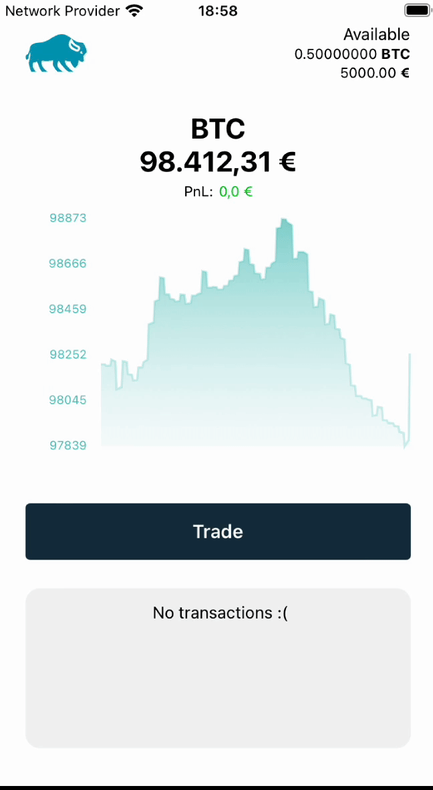

ReactNativeCryptoTradingExampleApp

React Native demo application that demonstrates a simple cryptocurrency trading platform. 

Features:
Displays current Bitcoin price which is fetched from the Coinbase API
Presents the recent price history of Bitcoin in a chart
Tracks the user's portfolio balance and P&L (Profit and Loss)
Allows users to execute buy and sell trades
Maintains a history of past transactions